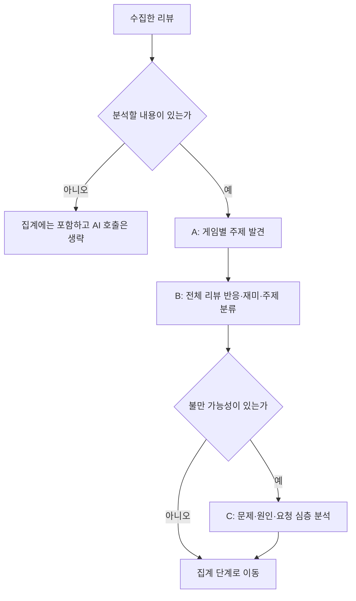
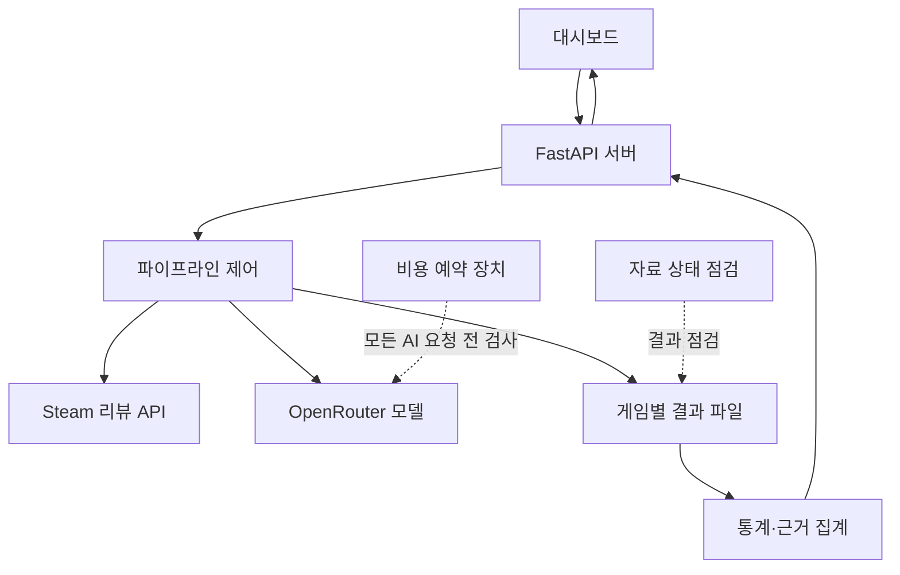

# AI 리뷰데이터 분석기 제품 설계서

## 1. 문서 목적

이 문서는 AI 리뷰데이터 분석기가 어떤 문제를 해결하고, 사용자가 입력한 Steam 게임 번호가 어떤 과정을 거쳐 대시보드의 인사이트로 바뀌는지를 설명한다.

개발자가 아닌 사람도 이해할 수 있도록 먼저 쉬운 말로 설명하고, 그 아래에 실제 구현 기준을 덧붙였다. 포트폴리오에서는 다음 세 가지를 중심으로 활용할 수 있다.

1. 무엇을 분석하도록 설계했는가
2. AI 비용과 모델 차이를 어떻게 통제했는가
3. 분석 결과를 어떻게 빠르게 이해하고 원문으로 검증하게 했는가

---

## 2. 한 문장 소개

Steam 리뷰를 일정한 기준으로 수집하고, AI로 반응과 주제를 분류한 뒤, 게임기획자가 **전체 분위기 → 강점과 문제 → 특정 이용자 구간 → 실제 리뷰 원문** 순서로 확인하게 하는 분석 도구다.

### 이 도구가 필요한 이유

Steam 리뷰를 직접 읽으면 다음 문제가 생긴다.

- 리뷰가 많아질수록 전부 읽기 어렵다.
- 눈에 띄는 강한 불만 몇 개를 전체 의견처럼 오해할 수 있다.
- “재미있다”, “렉이 심하다”, “친구와 하면 좋다”처럼 서로 다른 종류의 말이 뒤섞여 있다.
- AI에게 원문 전체를 한꺼번에 보내면 비용이 커지고 결과 형식도 불안정해진다.
- 요약만 보면 AI가 실제 리뷰에 없는 내용을 만들어도 알아차리기 어렵다.

따라서 이 제품은 리뷰를 한 번에 요약하지 않는다. 수집, 짧은 분류, 필요한 리뷰만 심층 분석, 코드 집계, 원문 확인으로 작업을 나눈다.

---

## 3. 핵심 설계 원칙

### 3.1 결론보다 근거를 함께 보여준다

대시보드가 “최적화가 문제다”라고 알려주는 데서 끝나지 않는다. 해당 주제의 긍정·부정 언급 수, 플레이 시간 구간, 대표 문장, 실제 Steam 원문 링크를 함께 제공한다.

### 3.2 계산은 코드가 하고 해석만 AI가 한다

건수, 비율, 플레이 시간, 추천률 차이처럼 정해진 공식으로 계산할 수 있는 값은 파이썬이 계산한다. AI는 문장의 반응, 언급 주제, 문제와 요청처럼 문맥을 읽어야 하는 작업에만 사용한다.

이 구분은 비용을 줄이고, 같은 데이터에서 같은 숫자가 나오게 만든다.

가공 방법 자체가 기획자의 설계다. 실행할 때 사람은 무엇을(게임·언어·기간·정렬)과 얼마나(수집량)만 고르고, 주제 합치기와 지킬 것·고칠 것 고르기는 설계한 규칙이 자동으로 한다. 분석 설계 화면은 단계마다 사람 · AI · 규칙 중 누가 처리했는지 보여준다.

### 3.3 게임마다 주제를 새로 찾는다

모든 게임에 “전투, 스토리, 그래픽” 같은 고정 목록을 강요하지 않는다. 먼저 해당 게임 리뷰 일부에서 반복되는 대상을 찾고, 그 목록을 나머지 리뷰 분류에 재사용한다.

예를 들어 생존 게임에서는 저장, 건축, 서버 동기화가 나올 수 있고, 서사 게임에서는 캐릭터, 번역, 결말이 나올 수 있다. 화면 구조는 같지만 내용은 게임에 맞게 바뀐다.

AI가 같은 대상을 두 이름으로 나누는 일(예: 렉과 최적화)이 생긴다. 이것은 사람이 손으로 합치지 않고 규칙으로 합친다. 작은 주제가 붙은 (리뷰, 칭찬/불만) 중 80% 이상이 큰 주제에도 붙어 있거나, 띄어쓰기·기호만 다른 이름이면 큰 주제로 합치고 겹침 비율을 기록한다.

### 3.4 추천 여부와 문장 반응을 구분한다

Steam의 추천·비추천은 사용자가 누른 최종 선택이다. AI의 긍정·부정·혼합·판단 어려움은 리뷰 문장에 담긴 반응이다.

추천 리뷰에도 특정 기능에 대한 불만이 있을 수 있고, 비추천 리뷰에도 칭찬이 있을 수 있다. 두 값을 분리해야 “게임은 추천하지만 저장 기능은 불편하다” 같은 의견을 놓치지 않는다.

### 3.5 AI 결과는 확정 판정이 아니라 탐색용 분류다

AI가 붙인 주제와 요약은 사실 확인이 끝난 정답으로 다루지 않는다. 사용자가 원문을 바로 확인할 수 있게 하고, 작은 표본과 분류 누락을 화면과 보고서에 표시한다.

---

## 4. 전체 작동 흐름

```mermaid
flowchart LR
    A[Steam 게임 번호와 분석 조건 입력] --> B[게임 정보와 리뷰 모집단 조회]
    B --> C[표본 크기와 긍정·부정 수 결정]
    C --> D[Steam 리뷰 수집]
    D --> E[게임별 반복 주제 발견]
    E --> F[전체 리뷰 짧은 분류]
    F --> G[불만 가능 리뷰만 심층 분석]
    G --> H[자료 상태 점검]
    H --> I[코드로 통계 집계]
    I --> J[AI 요약 1회 또는 저장된 요약 재사용]
    J --> K[대시보드 표시]
    K --> L[선택한 주제의 실제 원문 확인]
```



쉽게 말하면 다음과 같다.

1. 분석할 게임과 언어를 고른다.
2. 리뷰를 몇 건 읽어야 할지 계산한다.
3. 추천과 비추천 리뷰를 나누어 수집한다.
4. 이 게임에서 반복되는 주제를 한 번 찾는다.
5. 모든 리뷰를 짧고 일정한 형식으로 분류한다.
6. 불만이 있는 리뷰만 자세히 읽는다.
7. 코드가 건수와 비율을 계산한다.
8. 대시보드는 중요한 결과부터 보여준다.
9. 사용자는 숫자의 근거가 된 원문을 확인한다.

---

## 5. 사용자가 분석을 시작하는 과정

### 입력 항목

| 입력 | 의미 |
| --- | --- |
| Steam 게임 번호 | 분석할 게임을 식별하는 번호 |
| 언어 | 한국어, 영어 또는 전체 언어 등 수집 범위 |
| 분석 모델 | OpenRouter에서 사용할 무료 또는 유료 모델 |
| 목표 오차 | 표본 수를 정하기 위한 기준 |
| 직접 지정 수량 | 사용자가 리뷰 수를 직접 제한할 때 사용 |
| 예산 | 한 번의 실행에서 허용할 최대 AI 비용 |
| 추가 수집 | 기존 결과에 새 리뷰를 더할지 여부 |

게임 번호를 조회하면 분석 전에 게임 이름, Steam 평가, 해당 언어의 리뷰 수, 예상 분석량과 예상 비용을 보여준다. 사용자가 실행하기 전 규모를 파악할 수 있게 한 것이다.

### 빈 프로젝트를 만들지 않는 이유

사용자가 새 분석 화면을 열었다가 나갈 수 있다. 이때 프로젝트를 즉시 등록하면 내용 없는 카드가 프로젝트 목록에 남는다.

그래서 프로젝트는 `insights_v5.json`까지 정상 생성된 뒤에만 목록에 공개한다. 화면 진입은 프로젝트 생성이 아니며, 분석 완료가 프로젝트 생성 조건이다.

---

## 6. 1단계: Steam 리뷰 수집과 표본 설계

### 6.1 먼저 전체 규모를 확인한다

Steam 리뷰 API에서 선택한 언어의 다음 값을 가져온다.

- 전체 리뷰 수
- 추천 리뷰 수
- 비추천 리뷰 수
- Steam이 제공하는 전체 평가

이 값은 AI가 판단하지 않는다. Steam 원자료를 그대로 사용한다.

### 6.2 몇 건을 수집할지 계산한다

표본 크기는 두 조건 중 더 큰 값을 사용한다.

1. 설정한 오차 범위를 만족하는 데 필요한 수
2. 비추천 리뷰를 최소 목표 수만큼 확보하는 데 필요한 수

표본 수 계산에는 유한 모집단 보정을 포함한 Cochran 공식을 사용한다.

```text
필요 표본 수 = max(오차 기준 표본 수, 비추천 최소 확보 표본 수)
최종 표본 수 = min(필요 표본 수, 전체 리뷰 수)
```

예를 들어 전체 추천률이 매우 높으면 일반적인 표본만으로는 비추천 리뷰가 거의 들어오지 않을 수 있다. 그러면 문제 분석에 필요한 자료가 부족해진다. 이를 막기 위해 비추천 최소 목표를 함께 사용한다.

### 6.3 추천과 비추천을 나누어 수집한다

결정된 전체 표본 수를 모집단의 추천·비추천 비율에 맞춰 나눈다. Steam API에 추천과 비추천을 각각 요청하고 중복 리뷰 번호는 제거한다.

저장되는 주요 원자료는 다음과 같다.

- 리뷰 번호
- 리뷰 본문
- 언어
- 추천 여부
- 도움됨 수
- 리뷰 작성 당시 플레이 시간
- 현재 누적 플레이 시간
- 작성자 식별값
- 작성 시각

### 수집 방식의 한계

기본 수집 방식은 무작위다. 수집 범위의 리뷰를 끝까지 훑은 뒤(최대 6만 건) 그중에서 고정된 난수로 뽑는다. 범위를 끝까지 훑고 계획한 만큼 모았을 때에만 오차범위를 화면에 표시한다. 최신순·공감순으로 모을 수도 있는데, 이때는 무작위 표본이 아니므로 오차범위를 표시하지 않는다.

무작위로 뽑아도 남는 한계가 있다.

- Steam 리뷰는 스스로 쓴 사람의 의견이다. 리뷰를 쓰지 않은 플레이어까지 대표하지 않는다.
- 오차범위는 "추천 비율"에만 해당한다. 주제별 비율과 AI 분류의 정확도는 포함하지 않는다.
- "비추천 100건"은 보장이 아니라 기대값이다. 무작위로 뽑으므로 실제로는 조금 많거나 적다.

포트폴리오에서는 다음처럼 설명하는 것이 정확하다.

> 수집 범위를 전부 훑고 무작위로 뽑아, 추천 비율에 대해서는 오차범위를 말할 수 있게 했다. 주제별 숫자는 AI가 분류한 결과이므로 오차범위를 붙이지 않고 원문 확인을 전제로 했다.

---

## 7. 2단계: AI 분석 구조

AI 분석은 한 번의 거대한 요청이 아니라 A, B, C 세 단계로 나뉜다.



### 7.1 분석 전 필터

본문이 한 글자이거나 정보가 거의 없는 리뷰는 AI에 보내지 않는다. 다만 “렉”, “버그”, “튕김”, “환불”처럼 짧아도 문제를 나타내는 리뷰와 비추천 리뷰는 보존한다.

이 과정은 단순히 비용을 줄이는 필터가 아니다. 의미 없는 입력 때문에 모델 결과가 흐려지는 것도 막는다.

### 7.2 A단계: 게임별 주제 발견

서로 겹치지 않는 리뷰 묶음 세 개(묶음마다 최대 100건)에서 각각 주제 후보를 찾고, 후보를 한 번 더 정리해 이 게임에서 반복되는 대상을 10~16개로 정한다. 무엇을 하며 노는지(수집, 전투 등)와 기능은 아니지만 반복되는 불만 대상(버그, 콘텐츠 분량 등)을 따로 찾는다.

추천과 비추천 리뷰가 모두 포함되도록 교차 배치한다. 긴 비추천 리뷰를 먼저 확보하고, 추천 리뷰는 고정된 난수 기준으로 섞어 같은 데이터에서는 같은 표본을 만들도록 했다.

주제 이름에는 평가를 넣지 않는다.

| 좋은 주제 | 피해야 할 주제 | 이유 |
| --- | --- | --- |
| 저장 | 저장이 나쁨 | 주제와 평가를 분리해야 함 |
| 서버 동기화 | 게임플레이 | 너무 넓은 범주를 피함 |
| 캐릭터 디자인 | 귀여운 캐릭터 | 평가가 섞이면 긍정·부정 공통 사용이 어려움 |

결과는 `themes_v3.json`에 저장하고 이후 전체 분류에서 재사용한다. 같은 실행에서 리뷰마다 주제를 다시 찾지 않으므로 결과가 일정하고 토큰 사용이 줄어든다.

### 7.3 B단계: 전체 리뷰의 짧은 분류

분석 대상 리뷰를 15건씩 묶어 보낸다. 본문이 같은 리뷰는 한 번만 보내고 결과를 함께 쓴다. 각 리뷰에서 다음만 받는다.

| 결과 | 설명 |
| --- | --- |
| 반응 | 긍정, 부정, 혼합, 판단 어려움 |
| 재미 종류 | 긍정·혼합 리뷰에서 드러난 재미 1~2개 |
| 주제별 방향 | 언급한 주제에 대한 긍정 또는 부정 |
| 한 줄 표현 | 이용자 입장에서 20자 안팎으로 정리한 말 |

반응은 짧은 코드로 주고받는다.

```text
P = 긍정
N = 부정
M = 혼합
U = 판단 어려움
```

주제도 `[주제, P 또는 N]` 형태로만 받는다. 설명 문장을 길게 생성하게 하지 않아 출력 토큰을 줄인다.

재미 종류는 다음 8개를 사용한다.

- 감각: 보고 듣는 즐거움
- 판타지: 세계관과 역할에 몰입
- 이야기: 서사와 캐릭터
- 도전: 어려움을 이겨내는 성취
- 함께: 다른 이용자와 협동·경쟁
- 발견: 탐험과 새로운 것 찾기
- 표현: 꾸미기·건축·창작
- 몰두: 시간 가는 줄 모르는 반복

이 분류는 기존의 세부 감정 이름을 많이 나누는 방식과 목적이 다르다. 화면에 감정 이름을 늘어놓기 위한 분류가 아니라, 추천 이용자가 어떤 경험을 재미로 느끼는지 기획 언어로 묶기 위한 분류다.

### 7.4 C단계: 불만 가능 리뷰만 심층 분석

모든 리뷰를 길게 분석하면 비용이 크게 늘어난다. 다음 조건 중 하나를 만족한 리뷰만 다시 읽는다.

- 전체 반응이 부정 또는 혼합
- Steam에서 비추천
- 특정 주제에 부정 방향이 붙음

심층 결과는 주제별로 세 부분을 구분한다.

| 항목 | 질문 | 규칙 |
| --- | --- | --- |
| 문제 | 무엇이 불편한가 | 25자 이내 |
| 원인 | 이용자가 직접 말한 원인은 무엇인가 | 추측 금지, 없으면 빈 값 |
| 요청 | 이용자가 직접 요구한 해결책은 무엇인가 | 새 해결책 창작 금지 |

예를 들어 “업데이트 뒤 특정 지역에서 프레임이 떨어진다. 그래픽 설정을 더 세분화해 달라”는 리뷰는 다음처럼 나뉜다.

```json
{
  "주제": "최적화",
  "문제": "특정 지역에서 프레임 저하",
  "원인": "업데이트 이후 발생",
  "요청": "그래픽 설정 세분화"
}
```

리뷰에 원인이나 해결책이 없다면 빈 값으로 둔다. AI가 그럴듯한 원인과 해결책을 만들어내는 것을 막기 위한 규칙이다.

---

## 8. 모델이 바뀌어도 결과 구조를 유지하는 방법

OpenRouter에서는 선택 가능한 모델이 계속 바뀔 수 있다. 무료 모델과 유료 모델의 성능과 출력 습관도 다르다. 이 제품은 특정 모델의 말투에 기대지 않고 출력 계약을 고정한다.

### 8.1 모델 공통 출력 계약

- 자연어 보고서 대신 JSON만 요구한다.
- 허용된 필드와 값의 종류를 프롬프트에 적는다.
- 주제는 A단계에서 만든 목록 안에서만 선택한다.
- 재미 종류도 정해진 목록 안에서만 선택한다.
- 추천 여부만 보고 반응을 정하지 말라고 명시한다.
- 원문에 없는 원인과 해결책을 만들지 말라고 명시한다.
- 온도는 0.2로 낮게 설정해 결과 변동을 줄인다.

### 8.2 모델 기능에 따른 대응

실행 전에 OpenRouter 모델 목록에서 다음을 확인한다.

- 텍스트 입력과 출력 지원 여부
- 문맥 길이가 32,768 이상인지
- JSON 응답 형식을 지원하는지
- 입력·출력·요청 단가
- 무료 모델인지 유료 모델인지

JSON 형식을 지원하는 모델에는 JSON 응답 설정을 추가한다. 해당 설정을 거부하면 일반 응답으로 한 번 재시도하고, 코드 블록이나 앞뒤 설명이 붙은 경우 필요한 JSON 부분만 추출한다.

### 8.3 결과 검증과 부분 재시도

모델이 돌려준 값은 그대로 저장하지 않는다.

- 요청한 리뷰 번호가 응답에 있는지 확인한다.
- 허용된 반응 코드만 저장한다.
- 존재하는 주제만 저장한다.
- 허용된 재미 종류만 저장한다.
- 길이가 긴 결과는 필드별 상한으로 자른다.
- 묶음 응답에서 빠진 리뷰만 한 건씩 재시도한다.
- 실패 비율이 절반을 넘거나 결과가 0건이면 전체 단계를 실패 처리한다.

따라서 무료·유료 모델이 완전히 같은 판단을 한다고 보장하지는 않지만, **같은 질문에 같은 구조로 답하고 같은 검사를 통과하도록** 만든다.

### 8.4 모델을 바꿨을 때

이전 모델의 결과와 새 모델의 결과가 섞이지 않도록 기존 산출물을 보관한 뒤 전체 분석을 다시 수행한다. 비용 견적도 남은 리뷰만이 아니라 전체 재분석 기준으로 다시 계산한다.

---

## 9. 토큰과 비용 최적화 설계

### 9.1 비용이 새는 대표 원인과 대응

| 비용이 커지는 원인 | 적용한 대응 |
| --- | --- |
| 원문 전체를 한 번에 요약 | 주제 발견, 짧은 분류, 불만 심층으로 분리 |
| 모든 리뷰를 자세히 분석 | 불만 가능 리뷰만 C단계 실행 |
| 같은 주제를 매번 다시 설명 | A단계 결과를 저장해 재사용 |
| 긴 답변 요구 | 짧은 키와 길이 제한을 둔 JSON 사용 |
| 실패한 묶음 전체 재호출 | 빠진 리뷰만 단건 재시도 |
| 실행을 다시 하면 처음부터 분석 | JSONL에서 완료 번호를 읽고 남은 리뷰만 처리 |
| 같은 요약 반복 호출 | 입력과 모델의 해시가 같으면 저장된 요약 사용 |
| 숫자 계산까지 AI에 요청 | 파이썬에서 직접 계산 |

### 9.2 입력 크기 제한

- 주제 발견: 선택된 리뷰 본문을 각 300자까지 사용
- 전체 분류: 리뷰 한 건당 최대 480자 (앞부분 + 끝부분. 불만이 끝에 오는 경우가 많다)
- 불만 심층: 리뷰 한 건당 최대 720자 (앞부분 + 끝부분)
- 전체 분류 묶음: 15건
- 불만 심층 묶음: 5건
- 동시 요청: 최대 3개

모델 문맥 길이가 작으면 주제 발견 입력도 자동으로 줄인다. 무료 모델과 유료 모델에는 가능한 한 같은 근거량을 제공해 모델 가격 때문에 분석 조건 자체가 달라지지 않게 한다.

### 9.3 실행 전 비용 견적

아직 분석하지 않은 리뷰 수, 심층 분석 예상 수, 요약과 검증 필요 여부를 계산한다. 각 단계에 보수적인 입력·출력 토큰 허용량을 곱하고, 선택 모델의 실제 단가를 적용한다.

```text
예상 비용 =
  예상 입력 토큰 × 입력 단가
  + 예상 출력 토큰 × 출력 단가
  + 예상 요청 수 × 요청 단가
```

모델 단가는 OpenRouter 목록에서 실시간으로 읽으며 15분 동안만 저장한다. 모델 목록이나 가격을 읽지 못한 상태에서 임의의 가격으로 새 분석을 시작하지 않는다.

### 9.4 실행 중 예산 잠금

실행 전 견적만으로는 부족하다. 여러 요청이 동시에 실행되면 각각은 한도 안에 보여도 합계가 한도를 넘을 수 있다.

그래서 각 요청을 보내기 직전에 최대 사용 가능 비용을 먼저 예약한다.

```text
현재 사용액 + 이미 예약된 금액 + 새 요청 예약액 > 예산
→ 새 요청을 보내지 않고 중단
```

응답이 오면 OpenRouter의 실제 사용 토큰으로 예약액을 실제 비용으로 바꾼다. 사용량을 알 수 없는 응답은 안전하게 예약액 전체를 사용한 것으로 처리한다.

기본 예산은 5달러이며 서버 요청은 최대 100달러까지만 받는다. 이는 OpenRouter 계정 전체의 결제 제한이 아니라 프로그램 한 번의 실행을 막는 내부 안전장치다. 실제 청구액은 제공자 계산과 다를 수 있으므로 사용 기록도 별도로 저장한다.

### 9.5 중단 후 이어서 실행

분류 결과는 한 줄에 한 리뷰를 저장하는 JSONL 형식을 사용한다. 실행이 중간에 멈춰도 이미 저장한 리뷰 번호를 읽어 남은 리뷰만 다시 분석한다.

이 설계는 다음 상황에서 효과가 있다.

- 무료 모델의 일시적 호출 제한
- 네트워크 오류
- 사용자가 정한 예산 도달
- 프로그램 종료
- 일부 응답 누락

---

## 10. 품질 점검과 검증

### 10.1 자동 품질 점검

분석 후 다음을 확인한다.

- 수집 리뷰 중 몇 건이 분석됐는가
- 필수 필드가 비어 있지 않은가
- 허용되지 않은 반응 값이 들어오지 않았는가
- 모집단 추천 비율과 수집 표본의 추천 비율 차이가 큰가
- 판단 어려움이 지나치게 많지 않은가

Steam 추천 여부와 AI 반응이 다른 리뷰는 오류로 보지 않고 건수만 알려 준다. 점수에도 넣지 않는다. "추천하지만 버그는 짜증난다" 같은 리뷰를 찾아내는 것이 이 도구가 하는 일이어서, 두 값이 다르다고 감점하면 앞뒤가 맞지 않는다.

### 10.2 AI 분류를 어떻게 확인하는가

AI가 AI를 다시 채점하는 검증은 없앴다. 같은 계열 모델이 재판정하고 Steam 추천 여부를 정답으로 쓰는 방식은 정확도를 재는 것이 아니었다.

지금은 정확도를 숫자로 주장하지 않는다. 대신 화면의 모든 숫자에서 실제 리뷰 원문으로 내려갈 수 있게 하고, 분석 방법 화면에 "주제별 숫자는 원문 확인 필요"라고 적는다. 지시문을 바꿀 때에는 실제로 틀렸던 리뷰(예: 추천 리뷰의 "시간이 삭제됩니다"를 저장 불만으로 분류한 것)를 저장 없이 다시 분류해 고쳐졌는지 확인한다.

### 10.3 자동 검사

현재 자동 검사에서는 다음과 같은 위험을 확인한다.

- 작성 시 플레이 시간 0을 누락값으로 바꾸지 않는가
- 추천 여부와 문장 반응을 섞어 계산하지 않는가
- 한 리뷰가 같은 주제에 중복 집계되지 않는가
- 차트마다 올바른 분모를 사용하는가
- 일부 손상된 분석 행을 건너뛰고 수를 알리는가
- 모델 변경 시 전체 재분석 비용을 계산하는가
- 병렬 요청이 예산을 초과하지 않는가
- 완료되지 않은 프로젝트가 목록에 나타나지 않는가
- 요약 입력이 같을 때 저장된 결과를 재사용하는가

---

## 11. 집계와 인사이트 생성

### 11.1 코드가 계산하는 값

`build_insights_v5.py`와 `dashboard_evidence.py`는 AI를 추가 호출하지 않고 다음을 계산한다.

- 전체 반응 분포
- 주제별 긍정·부정 고유 리뷰 수
- 주제 언급 리뷰를 제외했을 때의 추천률 차이
- 플레이 시간별 비추천 비율
- 플레이 시간 구간별 불만 주제
- 추천·혼합 리뷰에서 나타난 재미 종류
- 주제별 대표 리뷰
- 수집 기간과 분석 범위

한 리뷰에 여러 주제가 있을 수 있으므로 주제별 수를 모두 더해 전체 리뷰 수와 비교하지 않는다. 같은 주제 안에서는 리뷰 번호 집합을 사용해 중복을 제거한다.

### 11.2 마지막 요약에서만 AI를 사용한다

집계가 끝난 뒤 AI를 한 번 호출해 게임기획자가 읽을 짧은 요약과 행동 항목을 만든다. 이때 원문 전체가 아니라 이미 계산된 핵심 사실과 불만 조각만 전달한다.

요약 프롬프트에는 다음 제한이 있다.

- 180자 이내 한 문단
- 강점과 아쉬운 점을 함께 언급
- 숫자는 꼭 필요한 1~2개만 사용
- 불만 건수 나열보다 이용자가 겪는 문제를 설명
- 원인이 없으면 만들지 않음
- 이용자가 요구하지 않은 해결책을 제안하지 않음

AI 요약이 실패하면 코드가 강점과 문제 주제를 조합해 기본 요약을 만든다. 따라서 요약 API 실패가 전체 대시보드를 막지 않는다.

### 11.3 요약 저장

모델, 시스템 지시문, 요약 입력을 합쳐 해시를 만든다. 이전 해시와 같으면 OpenRouter를 다시 호출하지 않고 저장된 요약을 사용한다.

데이터나 모델이 바뀌면 해시가 바뀌므로 새 요약을 생성한다.

---

## 12. 대시보드 정보 설계

대시보드는 사용자가 아래 순서로 읽도록 설계했다.

```text
게임과 분석 범위
→ 전체 반응
→ 핵심 인사이트 3개
→ 주제별 비교
→ 선택한 주제의 상세 근거
→ 플레이 시간별 차이
→ 실제 리뷰 원문
```

### 12.1 게임과 분석 범위

Steam에서 가져온 게임 이미지와 이름을 보여주고 다음 정보를 함께 표시한다.

- 분석 언어
- 수집 기간
- 수집 리뷰 수
- AI 분석 리뷰 수와 비율

사용자는 현재 화면이 어떤 게임과 범위를 설명하는지 먼저 알 수 있다.

### 12.2 전체 반응 분포

도넛 차트는 긍정, 혼합, 부정, 판단 어려움의 전체 구성비를 보여준다. 도넛 가운데에는 분석 건수를 표시해 비율의 분모를 바로 알 수 있게 했다.

옆 문장은 규칙 기반 구간 문구를 사용해 과도하게 AI 같은 표현을 줄인다. 예를 들어 긍정 비중이 높다면 “대체로 긍정적인 반응이 많은 게임입니다”처럼 요약하고, 아래에 실제 비율을 근거로 제시한다.

### 12.3 핵심 인사이트

처음 보는 사용자가 1초 안에 우선순위를 잡을 수 있도록 세 가지만 보여준다.

1. 긍정 반응이 가장 많이 모인 주제
2. 부정 반응이 가장 많이 모인 주제
3. 표본을 더 확인해야 하는 플레이 시간 구간

세 카드의 색은 의미를 구분한다.

- 파랑: 강점
- 빨강: 문제
- 주황: 추가 확인 필요

### 12.4 주제별 반응

가운데를 기준으로 왼쪽에는 부정 언급, 오른쪽에는 긍정 언급을 배치한다. 모든 주제는 같은 축을 사용한다.

막대 길이만 보고 비교할 수 있고, 숫자를 직접 표시해 정확한 건수도 확인할 수 있다. 행을 선택하면 오른쪽 상세 패널이 같은 주제로 바뀐다.

### 12.5 선택한 주제 상세

선택한 주제에 대해 다음을 보여준다.

- 긍정·부정 리뷰 수
- 전체 추천률과의 연관 차이
- 자주 나온 문제
- 이용자가 직접 말한 원인
- 이용자가 직접 요청한 개선
- 대표 리뷰
- 전체 원문 보기

추천률 차이는 인과관계가 아니다. 해당 주제 언급 리뷰를 제외했을 때의 관찰 차이이며, “이 문제를 고치면 추천률이 이만큼 오른다”는 뜻으로 사용하지 않는다.

### 12.6 플레이 시간별 비추천 비율

리뷰 작성 당시 플레이 시간을 네 구간으로 나눈다.

- 2시간 미만
- 2~20시간
- 20~100시간
- 100시간 이상

모든 막대는 0~100% 축을 사용한다. 30건 미만 구간은 표본이 적다는 경고를 표시한다.

이 차트는 서로 다른 이용자 집단을 비교한다. 한 사람이 오래 플레이하면서 생각이 어떻게 바뀌었는지를 보여주는 종단 분석은 아니다.

### 12.7 근거 원문

주제와 긍정·부정 방향을 선택하면 해당 조건에 맞는 리뷰를 20개씩 읽는다. 리뷰 본문, 추천 여부, 작성 시 플레이 시간, 도움됨 수, Steam 원문 링크를 제공한다.

대시보드를 여는 것과 원문을 탐색하는 것은 추가 AI 비용을 발생시키지 않는다. 이미 저장된 분류와 원자료를 읽기만 한다.

---

## 13. 여러 게임과 언어에 적용되는 방식

### 게임 독립성

팰월드는 예시 데이터일 뿐이다. 화면과 API는 게임 번호를 기준으로 해당 프로젝트 폴더를 읽는다. 게임 이미지와 이름도 Steam에서 가져온다.

게임별로 달라지는 것은 다음과 같다.

- 게임 이름과 이미지
- 리뷰 모집단
- 발견된 주제
- 반응과 재미 분포
- 문제·원인·요청
- 플레이 시간별 차이

변하지 않는 것은 분석 단계, 결과 파일 구조, 화면 배치와 시각화 규칙이다.

### 언어 처리

Steam API가 지원하는 언어 코드 또는 전체 언어를 선택할 수 있다. 원문 언어가 여러 개여도 주제 이름, 한 줄 표현, 문제·원인·요청은 한국어로 출력하도록 프롬프트에 명시한다.

언어를 바꾸어 추가 수집할 때 기존 데이터와 섞이지 않도록 기존 프로젝트의 수집 언어를 확인한다. 기존 언어와 새 언어가 다르면 단순 이어받기를 제한한다.

### 다국어 분석의 주의점

- 모델별 한국어 요약 품질이 다를 수 있다.
- 문화권에 따라 같은 표현의 강도가 다를 수 있다.
- 전체 언어 분석에서는 특정 언어가 수적으로 우세할 수 있다.
- 언어별 비교가 필요하면 언어를 나누어 별도 분석하는 편이 해석에 유리하다.

---

## 14. 파일과 구성 요소

### 주요 프로그램

| 파일 | 책임 |
| --- | --- |
| `main.py` | 화면 제공, API, 분석 시작과 결과 조회 |
| `config.py` | 게임, 언어, 모델, 예산, 파일 경로 설정 |
| `pipeline.py` | 수집부터 인사이트 생성까지 순서 제어 |
| `collect_reviews.py` | 모집단 조회, 표본 계산, 리뷰 수집 |
| `analyze_reviews_v3.py` | 주제 발견, 전체 분류, 불만 심층 분석 |
| `budget_control.py` | 요청 전 비용 예약과 실행 중 예산 통제 |
| `token_budget.py` | 남은 작업량과 예상 비용 계산 |
| `model_catalog.py` | OpenRouter 모델, 기능, 가격 조회 |
| `quality_check.py` | 자료 상태 점검(완전성, 분석 가능성) |
| `sampling.py` | 표본 크기, 오차, 불확실 판정에 쓰는 식 |
| `build_insights_v5.py` | 화면용 통계와 최종 요약 생성 |
| `dashboard_evidence.py` | 차트 집계와 근거 리뷰 조회 |
| `static/dashboard.html` | 전체 화면 구조와 사용자 동작 |
| `static/review-dashboard.js` · `.css` | 진단 요약 화면(IPA 매트릭스, 근거 패널, 한 장 보고서) |
| `static/review-pages.js` · `.css` | 심층 분석, 리뷰 원문, 수집 설계 화면 |

### 게임별 결과 파일

```text
프로젝트/<Steam 게임 번호>/
├── reviews.csv              # Steam 원자료
├── sample_design.json       # 표본을 정한 근거
├── themes_v3.json           # 게임별 주제 목록
├── analysis_v3.jsonl        # 리뷰별 짧은 분류
├── complaints_v3.jsonl      # 불만의 문제·원인·요청
├── usage_v3.json            # 단계별 호출과 토큰 사용량
├── summary_v5_cache.json    # 재사용 가능한 최종 요약
├── insights_v5.json         # 대시보드용 최종 데이터
└── pipeline_result.json     # 최근 실행 상태
```

`v3`는 리뷰별 분석 계약, `v5`는 대시보드용 집계 계약을 뜻한다. 현재 화면은 이 두 구조만 사용한다.

---

## 15. 오류와 예외 처리

| 상황 | 처리 방식 |
| --- | --- |
| Steam 리뷰가 없음 | 모집단 조회 단계에서 중단 |
| API 키가 없음 | AI 분석을 시작하지 않고 설정 오류 표시 |
| 모델이 사라짐 | 모델 목록에서 확인되지 않으면 실행 중단 |
| JSON 형식 설정 거부 | 일반 JSON 지시 방식으로 한 번 재시도 |
| 일시적 통신 오류 | 같은 요청을 한 번 재시도 |
| 묶음 일부 누락 | 누락 리뷰만 단건 재시도 |
| 치명적 인증·잔액 오류 | 즉시 중단 |
| 예산 초과 예상 | 새 AI 요청을 보내기 전에 중단 |
| 중간 종료 | 저장된 리뷰를 제외하고 이어서 실행 |
| 최종 요약 실패 | 코드 기반 기본 요약 사용 |
| 분석 파일 일부 손상 | 손상 행을 제외하고 누락 수 표시 |

게임별 분석은 잠금으로 보호해 같은 프로그램 설정을 사용하는 두 게임이 동시에 실행되며 서로의 경로나 모델 설정을 덮어쓰지 않게 한다.

---

## 16. 현재 한계와 개선 방향

### 현재 한계

1. 최신순 수집이므로 완전한 무작위 표본이 아니다.
2. AI 주제 분류는 오분류될 수 있다.
3. 추천률 연관 차이는 인과관계가 아니다.
4. 짧은 리뷰는 맥락이 부족해 판단 어려움이 늘 수 있다.
5. 서로 다른 언어를 한 번에 분석하면 언어별 차이가 가려질 수 있다.
6. Steam 추천 여부는 감정 분류의 완전한 정답이 아니다.
7. 모델이 바뀌면 같은 계약을 사용해도 세부 판단은 달라질 수 있다.

### 다음 개선 후보

1. 언어별 결과 비교 화면 추가
2. 주제별 수동 합치기·이름 수정 기능
3. 사람이 검토한 정답 표본을 이용한 모델 비교
4. 날짜 구간별 동일 주제 변화 추적
5. 업데이트 날짜와 불만 변화의 나란히 보기
6. 무작위 수집이 가능한 자료원 또는 반복 시점 표본 비교
7. 모델별 비용·누락률·사람 평가를 함께 보는 평가판

---

## 17. 포트폴리오에서 설명할 핵심

### 문제 정의

> 많은 리뷰를 단순 요약하면 눈에 띄는 의견이 과대표현되고, 요약의 근거를 확인하기 어렵습니다. 그래서 표본 설계, 구조화 분류, 조건부 심층 분석, 원문 검증을 하나의 흐름으로 설계했습니다.

### AI 사용 방식

> AI에는 문맥 해석이 필요한 주제와 반응 분류만 맡겼습니다. 건수와 비율은 코드가 계산하고, 원문에 없는 원인이나 해결책은 생성하지 못하도록 출력 계약을 제한했습니다.

### 비용 최적화

> 주제는 한 번만 찾고, 전체 리뷰는 짧은 JSON으로 묶어 분류했습니다. 자세한 분석은 불만 가능 리뷰에만 실행하며, 완료한 리뷰와 동일한 요약은 재호출하지 않습니다. 실행 중에는 병렬 요청 비용까지 미리 예약해 설정한 예산을 넘을 가능성이 있으면 다음 호출을 차단합니다.

### 시각화

> 첫 화면에서는 전체 반응과 강점·문제·표본 주의 구간 세 가지만 먼저 보여줍니다. 이후 주제별 비교, 플레이 시간 구간, 실제 원문 순서로 상세 근거를 확인하게 했습니다.

### 범용성

> 특정 게임의 주제를 코드에 고정하지 않았습니다. 게임마다 주제를 먼저 발견하지만 분석 결과의 구조와 대시보드 배치는 같기 때문에 다른 Steam 게임과 언어에도 같은 흐름을 적용할 수 있습니다.

### 데이터 해석 책임

> 최신순 표본과 AI 분류의 한계를 숨기지 않았습니다. 작은 표본은 경고하고, 추천 여부와 문장 반응을 구분하며, 연관 차이를 개선 효과로 표현하지 않습니다.

---

## 18. 면접에서 받을 수 있는 질문과 답변

### 왜 리뷰 전체를 한 번에 요약하지 않았나요?

한 번에 보내면 입력이 길어지고 비싼 모델이 필요하며, 결과가 어떤 리뷰에서 나왔는지 추적하기 어렵습니다. 그래서 리뷰별 구조화 결과를 먼저 저장하고 코드로 집계한 뒤, 마지막 요약에만 AI를 한 번 사용했습니다.

### 왜 추천 여부와 긍정·부정을 따로 저장했나요?

추천 리뷰에도 특정 기능 불만이 있고 비추천 리뷰에도 장점이 있기 때문입니다. 추천 여부는 최종 행동이고, 반응 분류는 문장 속 의견입니다. 둘을 분리해야 주제별 장단점을 정확히 볼 수 있습니다.

### 무료 모델도 사용할 수 있나요?

가능합니다. 무료와 유료 모델 모두 같은 JSON 계약과 검사를 사용합니다. 다만 판단 품질까지 동일하다고 보장하지는 않으며, 누락 결과 재시도와 품질 보고서로 차이를 확인합니다.

### 비용이 예상보다 크게 나오는 것을 어떻게 막나요?

실행 전에 남은 작업과 모델 단가로 비용을 계산합니다. 실행 중에는 각 요청의 최대 비용을 먼저 예약하고 전체 예약액이 예산을 넘으면 요청 자체를 보내지 않습니다. 완료 결과와 같은 요약은 저장본을 사용합니다.

### 팰월드 전용 화면 아닌가요?

아닙니다. 팰월드는 현재 예시 프로젝트다. 게임 이름과 이미지는 Steam에서 가져오고, 주제는 각 게임 리뷰에서 새로 찾는다. 모든 게임은 같은 v3 분석 구조와 v5 화면 구조를 사용합니다.

### AI가 잘못 분석하면 어떻게 하나요?

주제별 실제 리뷰를 바로 확인할 수 있고, 자동 품질 검사와 표본 재검증 결과를 함께 저장합니다. AI 결과를 확정 사실로 표현하지 않고 탐색 우선순위를 정하는 보조 정보로 사용합니다.

### 표본 오차를 신뢰해도 되나요?

수집 수를 정하는 기준으로는 유용하지만, 현재 수집이 최신순이므로 전체 이용자에 대한 무작위 표본의 오차 보장으로 사용할 수는 없습니다. 이 한계를 화면과 문서에서 분명히 밝힙니다.

---

## 19. 제품 구조 요약



이 제품의 핵심은 AI 모델 자체가 아니다. **표본을 정하는 기준, 모델이 바뀌어도 유지되는 출력 계약, 필요한 곳에만 토큰을 쓰는 단계 구조, 숫자에서 원문까지 이어지는 검증 흐름**이 제품의 설계 중심이다.
